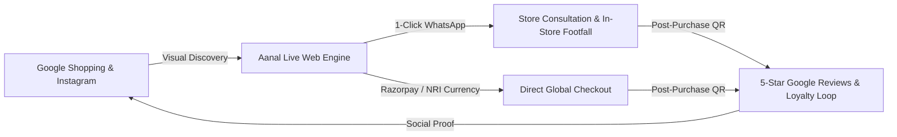

# Pitch Deck & Growth Plan: Aanal Gurukul &times; AntiGravity

> **Client Target**: Owner & Leadership Team, Aanal Gurukul (Shantam Complex, Gurukul Road, Ahmedabad)  
> **Prepared by**: AntiGravity Digital Commerce & Growth  
> **Interactive Live Demonstration**: [https://devibe70-ux.github.io/AANAL/](https://devibe70-ux.github.io/AANAL/)

---

## Executive Summary: From Passive Boutique to Omnichannel Powerhouse

Aanal Gurukul has established exceptional artisan authority in Ahmedabad for bridal couture, authentic Kutch mirror-work, Lakhnavi Chikankari, and contemporary draped silhouettes. However, **over 80% of modern ethnic couture discovery now begins on digital channels** (Instagram reels, Google Shopping, WhatsApp bridal inquiries, and overseas NRI searches).

AntiGravity does not just offer "website design." We deliver an **Integrated Customer Acquisition & Retention Engine** that transforms digital browsers into paying clients—both online and at your physical Gurukul Road boutique.

---

## 🎯 Pillar 1: Eliminating the Fractured Digital Journey

### The Pain Point
* Traditional static catalogs or PDF lookbooks create massive drop-offs. Customers see an outfit on Instagram, ask "Price please?", wait hours for a reply, and lose buying intent.
* Lack of size confidence leads to hesitation for high-ticket bridal and festive wear.

### The AntiGravity Solution: Interactive Demo Storefront
* **1-Click WhatsApp Commerce Box**: Every product card, story reel, and detail view features a direct WhatsApp Buy trigger pre-populated with exact SKU, size, color, and price. Zero friction.
* **Bespoke Made-to-Measure Engine**: Digital custom measurement module (Bust, Waist, Hips, Height, Blouse/Lehenga length) removes return anxieties and ensures master tailor accuracy.
* **Vercel Edge Geolocation & Multi-Currency Engine**: Automatically detects visitors from the USA, UK, UAE, Canada, and Australia, rendering prices in local currencies (`USD`, `GBP`, `AED`, `EUR`, `CAD`) to capture high-margin NRI wedding buyers.

---

## ⭐ Pillar 2: Monetizing Local Social Proof & Reputation Engine

### The Pain Point
* Satisfied bridal and festive customers leave the store thrilled, but rarely write Google Reviews unless prompted. Aanal's stellar offline reputation remains under-represented online.

### The AntiGravity Solution: Frictionless Review Capture Loop
1. **Dynamic Website Review Carousels**: Verified 5-star Google review feeds prominently displayed on the homepage build instant trust with first-time visitors.
2. **In-Store Checkout QR Desk Cards**: Sleek branded acrylic stands placed at the billing counter in the Shantam Complex store with a "Scan to Review & Receive 10% Off Next Festive Purchase" QR code.
3. **Automated Post-Delivery Review Pings**: Automated WhatsApp order follow-ups asking for fit feedback with a 1-tap Google Maps review link.

---

## 🛍️ Pillar 3: Invisible Search Engine Inventory & Google Merchant Domination

### The Pain Point
* When customers in Ahmedabad or abroad search Google for *"Wine Bridal Lehenga Ahmedabad"* or *"Pure Salsa Silk Palazzo Set"*, generic marketplaces like Myntra and Amazon rank because the boutique's catalog is not indexed into Google Shopping.

### The AntiGravity Solution: Automated Google Merchant Center Feed
* **Standardized RSS 2.0 XML Engine**: The site generates a live Google Shopping feed (`/api/feed.xml` / Google Merchant Center sync) that feeds title, high-resolution imagery, fabric specifications, availability, and pricing directly to Google.
* **High-Intent Search Capture**: Captures searchers looking for niche terms:
  - *Lakhnavi Chikankari Nayra Cut Suit*
  - *Plus-Size Festive Couture (3XL-5XL)*
  - *Gaji Silk Handloom Co-ord Set Ahmedabad*
* **Top-of-Page Visual Placements**: Displays Aanal's outfits at the very top of Google Search results with direct buy links.

---

## 💼 The AntiGravity Advantage: Strategic Growth Partner vs. Passive Agency

| Attribute | Traditional Web Developer | The AntiGravity Growth Engine |
| :--- | :--- | :--- |
| **Business Objective** | "Build a static site and disappear" | **Drive real revenue & Shantam boutique footfall** |
| **Catalog Architecture** | Manual, slow updates | **Pre-scraped, verified 22+ SKU live catalog** |
| **Payment & Ordering** | Basic form or third-party checkout | **Razorpay + 1-Click WhatsApp + UPI QR + COD** |
| **International NRI Reach** | Single currency (INR only) | **Vercel Edge Geo-detection (USD, GBP, AED, CAD)** |
| **Local Discovery** | None | **In-store review QR + Google Merchant Shopping Feed** |
| **Risk & Commitment** | Demands 100% advance before seeing anything | **14-Day Free Evaluation on Live Working Prototype** |

---

## 📈 Commercial Proposal & Phased Implementation

### 14-Day Zero-Risk Trial
* **The Site is Already Live**: [https://devibe70-ux.github.io/AANAL/](https://devibe70-ux.github.io/AANAL/)
* **Test Window**: 14 Days to test with actual customers and team members.

### Investment Packages
1. **Starter Digital Catalog (₹20,000)**: Mobile storefront, WhatsApp 1-Click Commerce, Store Locator.
2. **Growth E-Commerce (₹35,000 ⭐ Recommended)**: Full Razorpay/UPI/COD gateway, custom tailoring module, order tracker, GST invoices, Google Merchant XML feed, + ₹2,500/mo AMC.
3. **Luxury NRI & Bridal Enterprise (₹55,000)**: Multi-Currency edge converter, "Book a Call Now" stylist scheduling, priority festive campaigns.

---

## 🗣️ Closing Pitch Script for Owner Meeting

> *"Bhavinbhai / Sir, other agencies will pitch you slides and wireframes. We have already built your actual, high-speed luxury storefront with 22 of your real outfits, live right now on your smartphone.*
> 
> *Test the 'Buy on WhatsApp' button, try the custom stitching form, and see how fast it loads. We are giving you a **14-day free trial** to put this in your Instagram bio and share it with your VIP clients.*
> 
> *When you see the WhatsApp inquiries and orders rolling in, we will connect your official domain and scale your brand together. Let's take Aanal Gurukul global."*
