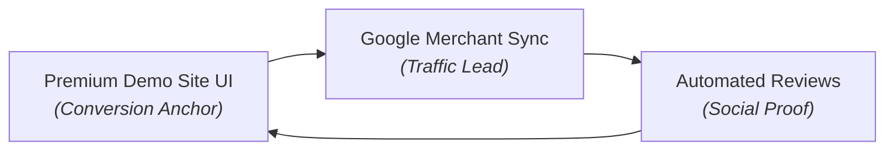

# Business Growth Proposal: Digital Upgrades for Aanal Gurukul

**Prepared for:** Aanal Gurukul (Ahmedabad)  
**Prepared by:** AntiGravity Agency  
**Live Demonstration:** [https://devibe70-ux.github.io/AANAL/](https://devibe70-ux.github.io/AANAL/)

---

## 1. The Core Objective
To transition Aanal Gurukul from a highly successful local retail boutique into an optimized, modern fashion brand. By addressing key structural pain points—specifically **Google Review integration**, **Google Product Listings (Merchant Center)**, and an updated **Modern UI/UX Web Presence**—we will convert foot-traffic loyalty into measurable online sales and regional dominance.

---

## 2. Identified Pain Points & AntiGravity Solutions

### ❌ Pain Point 1: Static Web Presence & Fractured Digital Journey
* **The Reality:** Local clients look online for inspiration before visiting. The existing or missing digital storefront doesn't fully capture the premium, high-glam nature of your unique collections (like Lakhnavi crop tops or Dola silk suits).
* **⚡ AntiGravity Solution (The Demo Site: [https://devibe70-ux.github.io/AANAL/](https://devibe70-ux.github.io/AANAL/)):**
  * Transition to a fully interactive, immersive web experience.
  * Curated interactive lookbooks tailored specifically for premium ethnic and Indo-Western attire.
  * Frictionless "Tap to Enquire via WhatsApp" loops for high-value designer inquiries.

### ❌ Pain Point 2: Low Local Social Proof Visibility (Google Reviews)
* **The Reality:** Happy walking clients frequently give verbal praise in-store, but these fail to reflect online. High-intent local users searching for "premium designer boutiques in Ahmedabad" prioritize stores with active, high-rating volumes.
* **⚡ AntiGravity Solution:**
  * **Dynamic Web Integration:** Embed real-time, automated Google Review carousels directly onto your landing pages to instantly establish authority for online visitors.
  * **In-Store QR Capture System:** Deploy physical, branded counter cards featuring customized QR codes that bypass steps and drop customers directly into the "Write a 5-Star Review" screen.

### ❌ Pain Point 3: Invisible Search Engine Inventory (Google Product Listings)
* **The Reality:** When shoppers search Google for specific items (e.g., *"Pure Chinon Sharara Set near me"* or *"Plus-size designer lehengas Ahmedabad"*), Aanal Gurukul’s physical stock doesn't show up in the automated visual carousel.
* **⚡ AntiGravity Solution:**
  * **Google Merchant Center Sync:** Build and optimize an automated local inventory feed that registers boutique items directly on Google Search & Shopping tabs.
  * **Visual Search Real Estate:** Ensure Aanal Gurukul surfaces at the absolute top of search result pages precisely when local buyers express transactional intent.

---

## 3. The Full Package Strategy & Deliverables

We have structured this upgrade as a unified, zero-friction package designed to minimize operational overhead for the boutique team while maximizing digital return on investment (ROI).

### Phase 1: Web Infrastructure Deployment (Based on Demo)
* Finalize and migrate the approved UX architecture from the developer sandbox environment (`devibe70-ux.github.io/AANAL`) to a custom production domain (`aanalgurukul.com`).
* Implement mobile-first layouts featuring lightweight, high-resolution media carousels to showcase intricate embroidery without compromising load speeds.
* Setup localized SEO parameters targeting key commercial phrases around the Gurukul Road retail hub.

### Phase 2: Hyper-Local Search Ecosystem (Reviews & Maps)
* **API Connection:** Link the website backend directly to the official Google Business Profile API.
* **Smart Filtering:** Display prominent 4 and 5-star reviews automatically while routing feedback loops internally for continuous quality control.
* **Physical Kits:** Design and print high-fidelity, custom-branded QR code plaques for point-of-sale checkout counters.

### Phase 3: Google Product & Search Integration
* Structural configuration of Google Merchant Center and sync parameters with your local inventory catalog.
* Optimization of product titles and attributes (e.g., specifying color arrays, material compositions, and inclusive sizing variables from regular to plus sizes) to maximize organic match rates.
* Geo-fencing setup ensuring product visibility peaks for shoppers within a 15km radius of Shantam Complex.

---

## 4. Why Partner with AntiGravity?
Traditional web agencies build passive, isolated websites. AntiGravity engineers comprehensive **customer acquisition loops**. We don't just build a digital catalog—we integrate your physical retail strengths directly into Google’s local ecosystems to drive predictable, scalable foot traffic and inbound digital sales inquiries.
